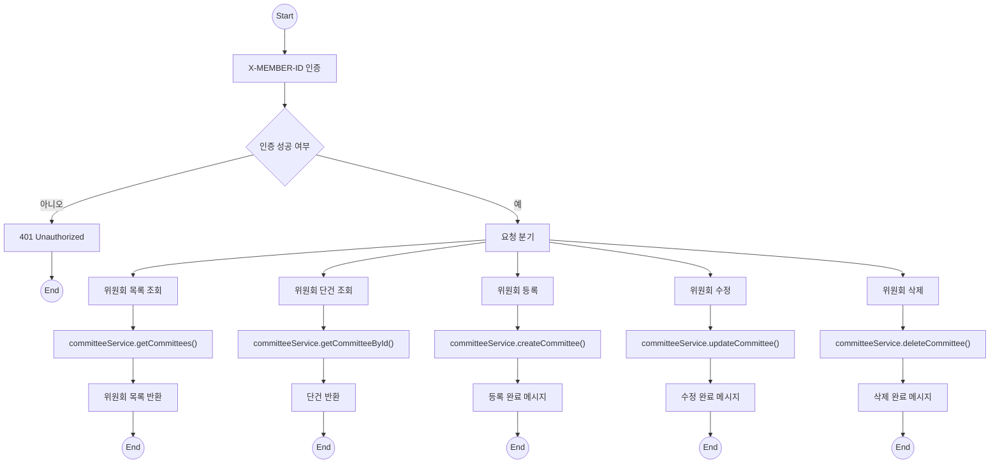
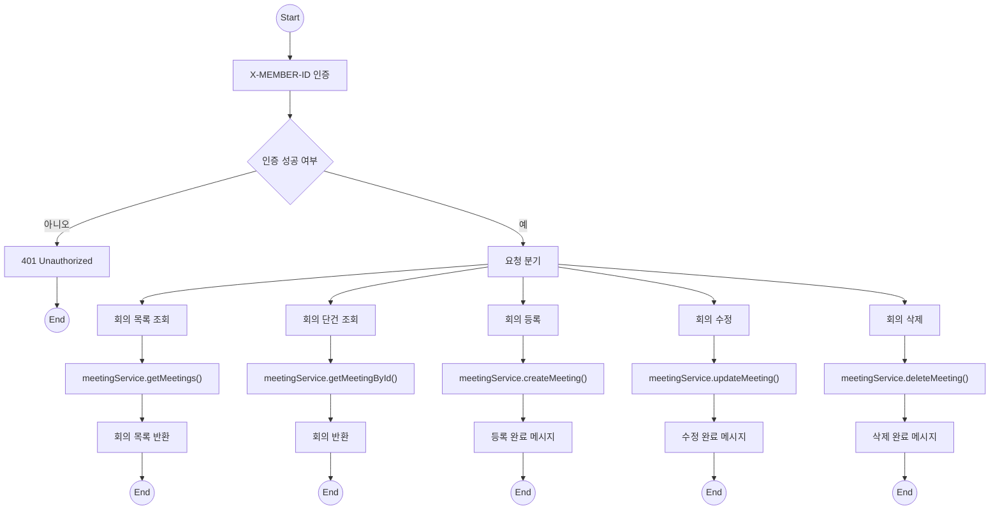
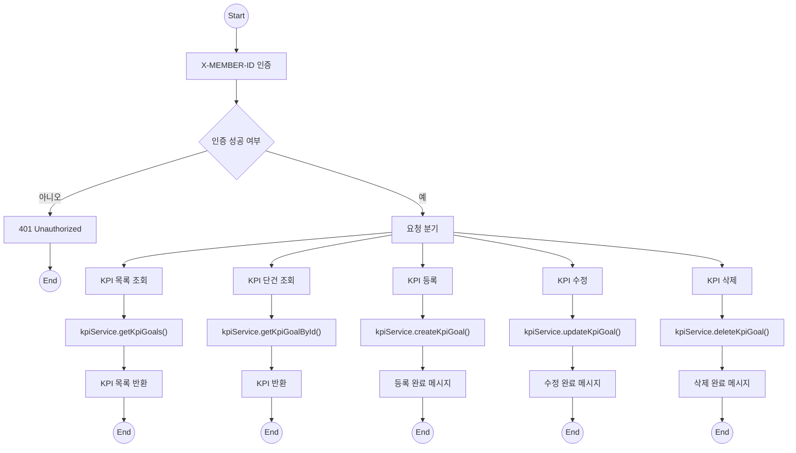

## 🌿 ESG 플랫폼 - Forest 테마 다이어그램 모음

> 모든 다이어그램은 `Mermaid` 문법 기반이며, `forest` 스타일 (녹색 테마)로 통일되어 있습니다. 인증 실패는 붉은 테마(`error`)로 표시됩니다.

---

### ✅ 공통 스타일 정의 (아래 모든 다이어그램에 포함됨)

```mermaid
%% 스타일 정의
classDef forest fill:#e6f4ea,stroke:#2e7d32,stroke-width:1.5px,color:#2e7d32;
classDef terminal fill:#d0f0c0,stroke:#1b5e20,color:#1b5e20;
classDef error fill:#fdecea,stroke:#c62828,color:#c62828;
```

---

## 1️⃣ 위원회 (Committee)



---

## 2️⃣ 회의 (Meeting)



---

## 3️⃣ KPI



---

[📄 나머지 다이어그램도 같은 구조로 이어서 추가됨 - 필요 시 계속 이어서 작성해드립니다.]
