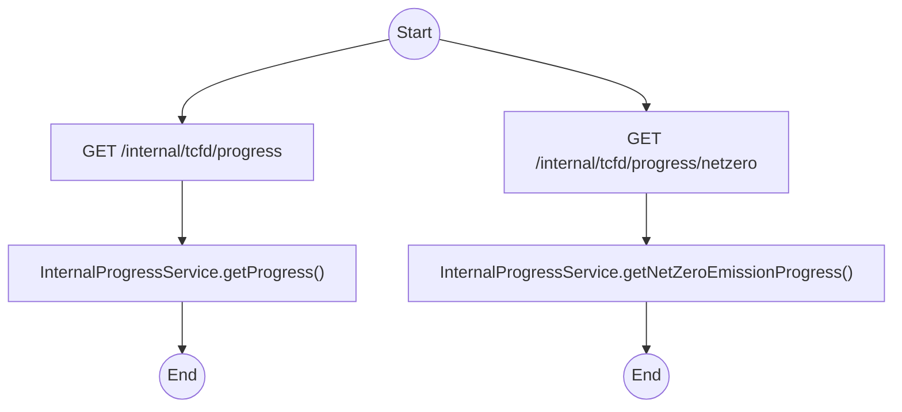
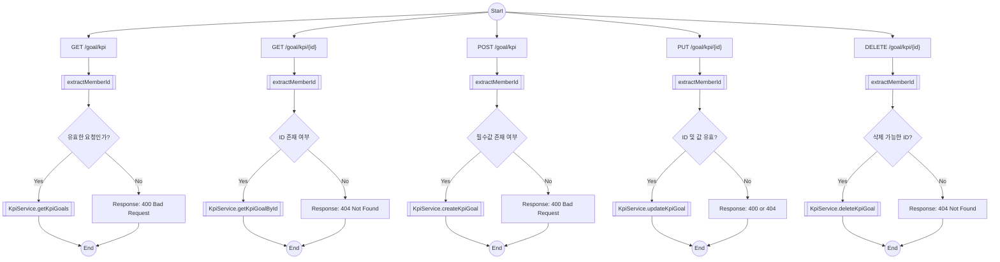
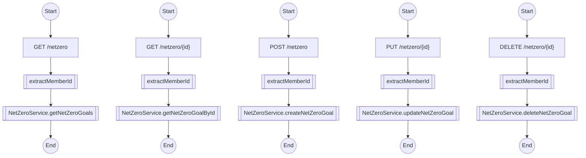

```mermaid
flowchart TD
    start((Start))

%% 시나리오 분석
    start --> scenarioGetAll["시나리오 전체 조회<br>GET /strategy/scenario"]
    scenarioGetAll --> extractId1["extractMemberId()"]
    extractId1 --> getScenarios["strategyService.getScenarios()"]
    getScenarios --> end1((End))

    start --> scenarioGetById["시나리오 단건 조회<br>GET /strategy/scenario/{id}"]
    scenarioGetById --> extractId2["extractMemberId()"]
    extractId2 --> getScenarioById["strategyService.getScenarioById()"]
    getScenarioById --> end2((End))

    start --> scenarioPost["시나리오 생성<br>POST /strategy/scenario"]
    scenarioPost --> extractId3["extractMemberId()"]
    extractId3 --> createScenario["strategyService.createScenario()"]
    createScenario --> end3((End))

    start --> scenarioPut["시나리오 수정<br>PUT /strategy/scenario/{id}"]
    scenarioPut --> extractId4["extractMemberId()"]
    extractId4 --> updateScenario["strategyService.updateScenario()"]
    updateScenario --> end4((End))

    start --> scenarioDelete["시나리오 삭제<br>DELETE /strategy/scenario/{id}"]
    scenarioDelete --> extractId5["extractMemberId()"]
    extractId5 --> deleteScenario["strategyService.deleteScenario()"]
    deleteScenario --> end5((End))

%% 리스크 식별
    start --> riskGetAll["리스크 전체 조회<br>GET /strategy/risk"]
    riskGetAll --> extractId6["extractMemberId()"]
    extractId6 --> getRisks["strategyService.getRisks()"]
    getRisks --> end6((End))

    start --> riskGetById["리스크 단건 조회<br>GET /strategy/risk/{id}"]
    riskGetById --> extractId7["extractMemberId()"]
    extractId7 --> getRiskById["strategyService.getRiskById()"]
    getRiskById --> end7((End))

    start --> riskPost["리스크 생성<br>POST /strategy/risk"]
    riskPost --> extractId8["extractMemberId()"]
    extractId8 --> createRisk["strategyService.createRisk()"]
    createRisk --> end8((End))

    start --> riskPut["리스크 수정<br>PUT /strategy/risk/{id}"]
    riskPut --> extractId9["extractMemberId()"]
    extractId9 --> updateRisk["strategyService.updateRisk()"]
    updateRisk --> end9((End))

    start --> riskDelete["리스크 삭제<br>DELETE /strategy/risk/{id}"]
    riskDelete --> extractId10["extractMemberId()"]
    extractId10 --> deleteRisk["strategyService.deleteRisk()"]
    deleteRisk --> end10((End))
```

```mermaid
flowchart TD
  start((Start))

  %% 위원회
  start --> CList["GET /committee"]
  CList --> CListSvc["getCommittees()"]
  CListSvc --> CListResp["위원회 목록 반환"]

  start --> COne["GET /committee/{id}"]
  COne --> COneSvc["getCommitteeById()"]
  COneSvc --> COneResp["위원회 상세 반환"]

  start --> CCreate["POST /committee"]
  CCreate --> CCreateSvc["createCommittee()"]
  CCreateSvc --> CCreateResp["생성 완료 메시지"]

  start --> CUpdate["PUT /committee/{id}"]
  CUpdate --> CUpdateSvc["updateCommittee()"]
  CUpdateSvc --> CUpdateResp["수정 완료 메시지"]

  start --> CDelete["DELETE /committee/{id}"]
  CDelete --> CDeleteSvc["deleteCommittee()"]
  CDeleteSvc --> CDeleteResp["삭제 완료 메시지"]

  %% 회의
  start --> MList["GET /meeting"]
  MList --> MListSvc["getMeetings()"]
  MListSvc --> MListResp["회의 목록 반환"]

  start --> MOne["GET /meeting/{id}"]
  MOne --> MOneSvc["getMeetingById()"]
  MOneSvc --> MOneResp["회의 상세 반환"]

  start --> MCreate["POST /meeting"]
  MCreate --> MCreateSvc["createMeeting()"]
  MCreateSvc --> MCreateResp["등록 완료 메시지"]

  start --> MUpdate["PUT /meeting/{id}"]
  MUpdate --> MUpdateSvc["updateMeeting()"]
  MUpdateSvc --> MUpdateResp["수정 완료 메시지"]

  start --> MDelete["DELETE /meeting/{id}"]
  MDelete --> MDeleteSvc["deleteMeeting()"]
  MDeleteSvc --> MDeleteResp["삭제 완료 메시지"]

  %% 경영진 KPI
  start --> KList["GET /executive-kpi"]
  KList --> KListSvc["getExecutiveKpis()"]
  KListSvc --> KListResp["KPI 목록 반환"]

  start --> KOne["GET /executive-kpi/{id}"]
  KOne --> KOneSvc["getExecutiveKpiById()"]
  KOneSvc --> KOneResp["KPI 상세 반환"]

  start --> KCreate["POST /executive-kpi"]
  KCreate --> KCreateSvc["createExecutiveKpi()"]
  KCreateSvc --> KCreateResp["등록 완료 메시지"]

  start --> KUpdate["PUT /executive-kpi/{id}"]
  KUpdate --> KUpdateSvc["updateExecutiveKpi()"]
  KUpdateSvc --> KUpdateResp["수정 완료 메시지"]

  start --> KDelete["DELETE /executive-kpi/{id}"]
  KDelete --> KDeleteSvc["deleteExecutiveKpi()"]
  KDeleteSvc --> KDeleteResp["삭제 완료 메시지"]

  %% 환경 교육
  start --> EList["GET /education"]
  EList --> EListSvc["getEducations()"]
  EListSvc --> EListResp["교육 목록 반환"]

  start --> EOne["GET /education/{id}"]
  EOne --> EOneSvc["getEducationById()"]
  EOneSvc --> EOneResp["교육 상세 반환"]

  start --> ECreate["POST /education"]
  ECreate --> ECreateSvc["createEducation()"]
  ECreateSvc --> ECreateResp["등록 완료 메시지"]

  start --> EUpdate["PUT /education/{id}"]
  EUpdate --> EUpdateSvc["updateEducation()"]
  EUpdateSvc --> EUpdateResp["수정 완료 메시지"]

  start --> EDelete["DELETE /education/{id}"]
  EDelete --> EDeleteSvc["deleteEducation()"]
  EDeleteSvc --> EDeleteResp["삭제 완료 메시지"]

  %% 끝
  EDeleteResp --> done((End))
```

```mermaid
flowchart TD
  start((Start))

  %% TCFD 종합 진행률 조회
  start --> getProgress["GET /internal/tcfd/progress"]
  getProgress --> callProgress["InternalProgressService.getProgress()"]
  callProgress --> end1((End))

  %% NetZero 배출량 진행률 조회
  start --> getNetZero["GET /internal/tcfd/progress/netzero"]
  getNetZero --> callNetZero["InternalProgressService.getNetZeroEmissionProgress()"]
  callNetZero --> end2((End))
```

```mermaid
flowchart TD
    start((Start))

%% KPI 전체 조회
    start --> getAllKpi["GET /goal/kpi"]
    getAllKpi --> extract1[[extractMemberId]]
    extract1 --> isValid1{"유효한 요청인가?"}
    isValid1 -- Yes --> serviceAll[[KpiService.getKpiGoals]]
    isValid1 -- No --> error1["Response: 400 Bad Request"]
    serviceAll --> end1((End))
    error1 --> end1

%% KPI 단건 조회
    start --> getOneKpi["GET /goal/kpi/{id}"]
    getOneKpi --> extract2[[extractMemberId]]
    extract2 --> isValid2{"ID 존재 여부"}
    isValid2 -- Yes --> serviceOne[[KpiService.getKpiGoalById]]
    isValid2 -- No --> error2["Response: 404 Not Found"]
    serviceOne --> end2((End))
    error2 --> end2

%% KPI 생성
    start --> postKpi["POST /goal/kpi"]
    postKpi --> extract3[[extractMemberId]]
    extract3 --> isValid3{"필수값 존재 여부"}
    isValid3 -- Yes --> servicePost[[KpiService.createKpiGoal]]
    isValid3 -- No --> error3["Response: 400 Bad Request"]
    servicePost --> end3((End))
    error3 --> end3

%% KPI 수정
    start --> putKpi["PUT /goal/kpi/{id}"]
    putKpi --> extract4[[extractMemberId]]
    extract4 --> isValid4{"ID 및 값 유효?"}
    isValid4 -- Yes --> servicePut[[KpiService.updateKpiGoal]]
    isValid4 -- No --> error4["Response: 400 or 404"]
    servicePut --> end4((End))
    error4 --> end4

%% KPI 삭제
    start --> deleteKpi["DELETE /goal/kpi/{id}"]
    deleteKpi --> extract5[[extractMemberId]]
    extract5 --> isValid5{"삭제 가능한 ID?"}
    isValid5 -- Yes --> serviceDelete[[KpiService.deleteKpiGoal]]
    isValid5 -- No --> error5["Response: 404 Not Found"]
    serviceDelete --> end5((End))
    error5 --> end5
```

```mermaid
flowchart TD

%% 전체 조회
    start1((Start)) --> getAllNetZero["GET /netzero"]
    getAllNetZero --> extractMemberId1[[extractMemberId]]
    extractMemberId1 --> callGetAll[[NetZeroService.getNetZeroGoals]]
    callGetAll --> end1((End))

%% 단건 조회
    start2((Start)) --> getNetZeroById["GET /netzero/{id}"]
    getNetZeroById --> extractMemberId2[[extractMemberId]]
    extractMemberId2 --> callGetOne[[NetZeroService.getNetZeroGoalById]]
    callGetOne --> end2((End))

%% 생성
    start3((Start)) --> postNetZero["POST /netzero"]
    postNetZero --> extractMemberId3[[extractMemberId]]
    extractMemberId3 --> callCreate[[NetZeroService.createNetZeroGoal]]
    callCreate --> end3((End))

%% 수정
    start4((Start)) --> putNetZero["PUT /netzero/{id}"]
    putNetZero --> extractMemberId4[[extractMemberId]]
    extractMemberId4 --> callUpdate[[NetZeroService.updateNetZeroGoal]]
    callUpdate --> end4((End))

%% 삭제
    start5((Start)) --> deleteNetZero["DELETE /netzero/{id}"]
    deleteNetZero --> extractMemberId5[[extractMemberId]]
    extractMemberId5 --> callDelete[[NetZeroService.deleteNetZeroGoal]]
    callDelete --> end5((End))
```