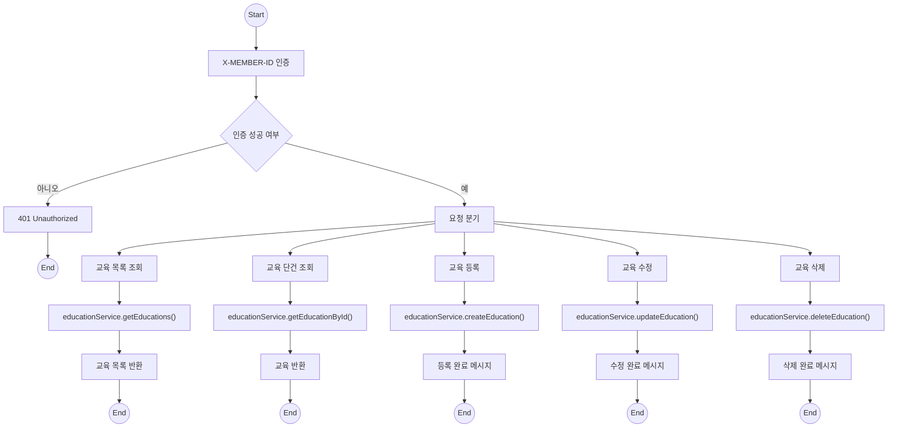
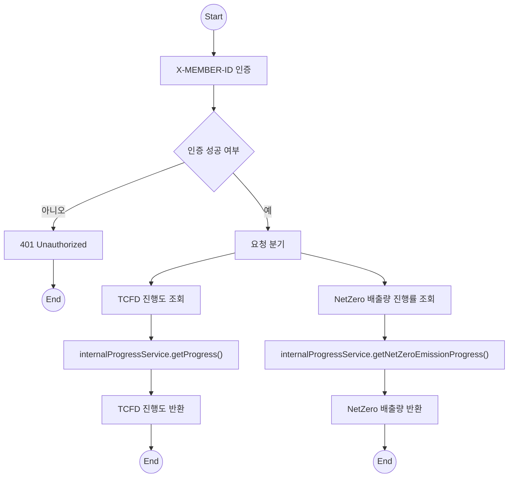
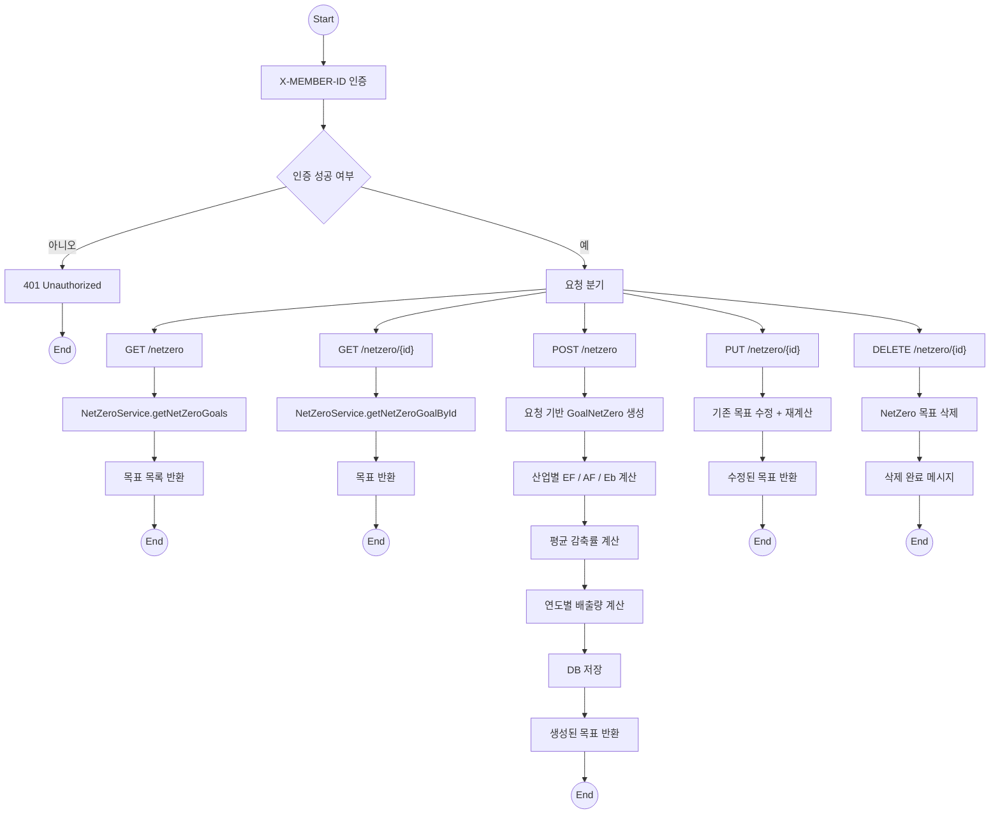
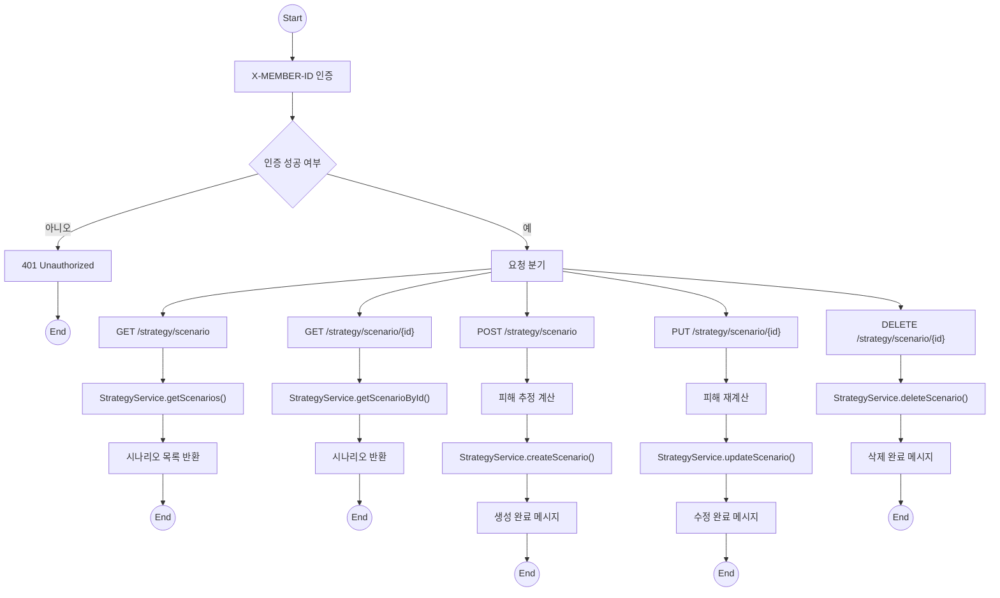
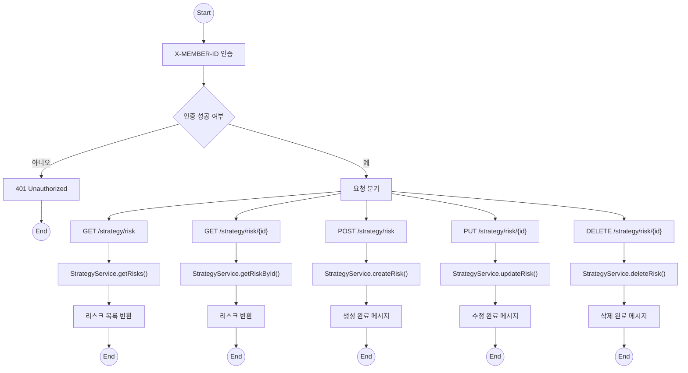

```mermaid
flowchart TD

%% 공통 시작 및 인증 처리
    Start((Start))
    Start --> Auth["X-MEMBER-ID 인증"]
    Auth --> AuthCheck{"인증 성공 여부"}
    AuthCheck -- "아니오" --> Error401["401 Unauthorized"] --> EndErr((End))
    AuthCheck -- "예" --> Router["요청 분기"]

%% 목록 조회
    Router --> GetList["회의 목록 조회"]
    GetList --> SvcList["meetingService.getMeetings()"]
    SvcList --> RespList["회의 목록 반환"]
    RespList --> End1((End))

%% 단건 조회
    Router --> GetOne["회의 단건 조회"]
    GetOne --> SvcOne["meetingService.getMeetingById()"]
    SvcOne --> RespOne["회의 반환"]
    RespOne --> End2((End))

%% 등록
    Router --> Create["회의 등록"]
    Create --> SvcCreate["meetingService.createMeeting()"]
    SvcCreate --> RespCreate["등록 완료 메시지"]
    RespCreate --> End3((End))

%% 수정
    Router --> Update["회의 수정"]
    Update --> SvcUpdate["meetingService.updateMeeting()"]
    SvcUpdate --> RespUpdate["수정 완료 메시지"]
    RespUpdate --> End4((End))

%% 삭제
    Router --> Delete["회의 삭제"]
    Delete --> SvcDelete["meetingService.deleteMeeting()"]
    SvcDelete --> RespDelete["삭제 완료 메시지"]
    RespDelete --> End5((End))

%% 색상 스타일 정의
    classDef forest fill:#e6f4ea,stroke:#2e7d32,stroke-width:1.5px,color:#2e7d32;
    classDef terminal fill:#d0f0c0,stroke:#1b5e20,color:#1b5e20;
    classDef error fill:#fdecea,stroke:#c62828,color:#c62828;

%% 클래스 적용 (줄바꿈 없이 한 줄에 작성)
    class Start,End1,End2,End3,End4,End5,EndErr terminal;
    class Auth,AuthCheck,Router,GetList,GetOne,Create,Update,Delete,SvcList,SvcOne,SvcCreate,SvcUpdate,SvcDelete,RespList,RespOne,RespCreate,RespUpdate,RespDelete forest;
    class Error401 error;

---


```mermaid
flowchart TD

%% 공통 시작 및 인증 처리
    Start((Start))
    Start --> Auth["X-MEMBER-ID 인증"]
    Auth --> AuthCheck{"인증 성공 여부"}
    AuthCheck -- "아니오" --> Error401["401 Unauthorized"] --> EndErr((End))
    AuthCheck -- "예" --> Router["요청 분기"]

%% KPI 목록 조회
    Router --> GetList["KPI 목록 조회"]
    GetList --> SvcList["kpiService.getKpiGoals()"]
    SvcList --> RespList["KPI 목록 반환"]
    RespList --> End1((End))

%% KPI 단건 조회
    Router --> GetOne["KPI 단건 조회"]
    GetOne --> SvcOne["kpiService.getKpiGoalById()"]
    SvcOne --> RespOne["KPI 반환"]
    RespOne --> End2((End))

%% KPI 등록
    Router --> Create["KPI 등록"]
    Create --> SvcCreate["kpiService.createKpiGoal()"]
    SvcCreate --> RespCreate["등록 완료 메시지"]
    RespCreate --> End3((End))

%% KPI 수정
    Router --> Update["KPI 수정"]
    Update --> SvcUpdate["kpiService.updateKpiGoal()"]
    SvcUpdate --> RespUpdate["수정 완료 메시지"]
    RespUpdate --> End4((End))

%% KPI 삭제
    Router --> Delete["KPI 삭제"]
    Delete --> SvcDelete["kpiService.deleteKpiGoal()"]
    SvcDelete --> RespDelete["삭제 완료 메시지"]
    RespDelete --> End5((End))
```









