## 🌱 TCFD 관리 기능 개요

본 서비스는 TCFD(Task Force on Climate-related Financial Disclosures) 권고안에 따라 기업의 기후 관련 재무 리스크 및 대응 전략을 체계적으로 수립할 수 있도록 지원합니다.
아래 기능들은 각 항목별로 입력, 수정, 조회, 삭제를 지원하며, ESG 공시 기준에 부합하는 보고체계를 제공합니다.

---

### 🧩 기능 설명

| 분류          | 설명                                                            |
| ----------- | ------------------------------------------------------------- |
| **거버넌스**    | 위원회 구성, 회의 이력, 경영진 KPI, 교육 내역 등 기후 관련 책임 체계를 정량적/정성적으로 관리합니다. |
| **전략**      | SSP 기반 시나리오 및 리스크 분석을 통해 기후 변화에 따른 자산/비즈니스 영향도를 시뮬레이션합니다.     |
| **목표 및 지표** | NetZero 목표 및 KPI를 설정하고, 산업별 배출량 계산과 연도별 감축 로드맵을 제공합니다.        |

---

### 🔐 인증 및 흐름 구조

* **모든 요청은 `X-MEMBER-ID` 기반 인증을 통해 보호**되며, 미인증 시 `401 Unauthorized` 응답을 반환합니다.
* 요청 흐름은 Gateway를 통해 API 라우팅되며, 각 기능은 서비스 단에서 처리 후 일관된 응답 포맷으로 반환됩니다.
* 입력 데이터는 내부적으로 EF (배출계수), AF (자산 비율), 평균 감축률 등을 기반으로 연산 후 저장됩니다.

---

### 📘 예시: 서비스 흐름 요약

* **거버넌스 > 위원회**

  * 위원회 목록 조회 → 상세정보 조회 → 생성 / 수정 / 삭제 가능
* **전략 > 리스크**

  * 리스크 목록 및 상세 분석 입력 → 전략별 리스크 대응 시나리오 관리
* **전략 > 시나리오**

  * SSP 시나리오 기반 기후 영향 입력 → 피해 추정 및 대응 전략 저장
* **목표 > NetZero**

  * 산업별 자산/배출량 기반 목표 설정 → 연도별 배출 시뮬레이션
* **목표 > KPI**

  * 조직의 지속가능 목표 지표 설정 및 진행률 관리

---

> 아래는 각 기능별 요청 흐름을 나타낸 Mermaid 기반 Flowchart입니다.

### 거버넌스 위원회

```mermaid
flowchart TD
    %% 스타일 정의 
    classDef process fill:#e6f4ea,stroke:#2e7d32,stroke-width:1.5px,color:#2e7d32
    classDef decision fill:#e6f4ea,stroke:#2e7d32,stroke-width:1.5px,color:#2e7d32
    classDef endpoint fill:#d0f0c0,stroke:#1b5e20,stroke-width:1.5px,color:#1b5e20
    classDef service fill:#e6f4ea,stroke:#2e7d32,stroke-width:1.5px,color:#2e7d32
    classDef response fill:#e6f4ea,stroke:#2e7d32,stroke-width:1.5px,color:#2e7d32
    classDef error fill:#fdecea,stroke:#c62828,stroke-width:1.5px,color:#c62828

    %% 공통 인증 처리
    Start((시작)) --> Auth["인증 확인\nX-MEMBER-ID 검증"]
    Auth --> AuthCheck{"인증 성공?"}
    AuthCheck -- "No" --> Error401["401 Unauthorized\n권한 없음"] --> EndErr((종료))
    AuthCheck -- "Yes" --> Router["요청 라우팅"]

    %% 목록 조회
    Router --> GetList["위원회 목록 조회"]
    GetList --> SvcList["governanceService.getCommittees()"]
    SvcList --> RespList["위원회 목록 반환\n200 OK"] --> End1((종료))

    %% 단건 조회
    Router --> GetOne["위원회 단건 조회"]
    GetOne --> SvcOne["governanceService.getCommitteeById()"]
    SvcOne --> RespOne["위원회 정보 반환\n200 OK"] --> End2((종료))

    %% 등록
    Router --> Create["위원회 등록"]
    Create --> SvcCreate["governanceService.createCommittee()"]
    SvcCreate --> RespCreate["등록 완료\n201 Created"] --> End3((종료))

    %% 수정
    Router --> Update["위원회 수정"]
    Update --> SvcUpdate["governanceService.updateCommittee()"]
    SvcUpdate --> RespUpdate["수정 완료\n200 OK"] --> End4((종료))

    %% 삭제
    Router --> Delete["위원회 삭제"]
    Delete --> SvcDelete["governanceService.deleteCommittee()"]
    SvcDelete --> RespDelete["삭제 완료\n204 No Content"] --> End5((종료))

    %% 스타일 적용
    class Start,End1,End2,End3,End4,End5,EndErr endpoint
    class Auth,GetList,GetOne,Create,Update,Delete,Router process
    class AuthCheck decision
    class SvcList,SvcOne,SvcCreate,SvcUpdate,SvcDelete service
    class RespList,RespOne,RespCreate,RespUpdate,RespDelete response
    class Error401 error
```

---
### 거버넌스 회의

---
### 거버넌스 경영진 KPI

```mermaid
flowchart TD
%% 스타일 정의 
    classDef process fill:#e6f4ea,stroke:#2e7d32,stroke-width:1.5px,color:#2e7d32
    classDef decision fill:#e6f4ea,stroke:#2e7d32,stroke-width:1.5px,color:#2e7d32
    classDef endpoint fill:#d0f0c0,stroke:#1b5e20,stroke-width:1.5px,color:#1b5e20
    classDef service fill:#e6f4ea,stroke:#2e7d32,stroke-width:1.5px,color:#2e7d32
    classDef response fill:#e6f4ea,stroke:#2e7d32,stroke-width:1.5px,color:#2e7d32
    classDef error fill:#fdecea,stroke:#c62828,stroke-width:1.5px,color:#c62828

%% 공통 시작 및 인증 처리
    Start((시작)) --> Auth["X-MEMBER-ID 인증"]
    Auth --> AuthCheck{"인증 성공 여부"}
    AuthCheck -- "아니오" --> Error401["401 Unauthorized"] --> EndErr((종료))
    AuthCheck -- "예" --> Router["요청 분기"]

%% KPI 목록 조회
    Router --> GetList["경영진 KPI 목록 조회"]
    GetList --> SvcList["governanceService.getExecutiveKpis()"]
    SvcList --> RespList["KPI 목록 반환"]
    RespList --> End1((종료))

%% KPI 단건 조회
    Router --> GetOne["경영진 KPI 단건 조회"]
    GetOne --> SvcOne["governanceService.getExecutiveKpiById()"]
    SvcOne --> RespOne["KPI 반환"]
    RespOne --> End2((종료))

%% KPI 등록
    Router --> Create["경영진 KPI 등록"]
    Create --> SvcCreate["governanceService.createExecutiveKpi()"]
    SvcCreate --> RespCreate["등록 완료 메시지"]
    RespCreate --> End3((종료))

%% KPI 수정
    Router --> Update["경영진 KPI 수정"]
    Update --> SvcUpdate["governanceService.updateExecutiveKpi()"]
    SvcUpdate --> RespUpdate["수정 완료 메시지"]
    RespUpdate --> End4((종료))

%% KPI 삭제
    Router --> Delete["경영진 KPI 삭제"]
    Delete --> SvcDelete["governanceService.deleteExecutiveKpi()"]
    SvcDelete --> RespDelete["삭제 완료 메시지"]
    RespDelete --> End5((종료))

%% 스타일 적용
    class Start,End1,End2,End3,End4,End5,EndErr endpoint
    class Auth,GetList,GetOne,Create,Update,Delete,Router process
    class AuthCheck decision
    class SvcList,SvcOne,SvcCreate,SvcUpdate,SvcDelete service
    class RespList,RespOne,RespCreate,RespUpdate,RespDelete response
    class Error401 error
```

---
### 거버넌스 교육

```mermaid
flowchart TD
    %% 스타일 정의 
    classDef process fill:#e6f4ea,stroke:#2e7d32,stroke-width:1.5px,color:#2e7d32
    classDef decision fill:#e6f4ea,stroke:#2e7d32,stroke-width:1.5px,color:#2e7d32
    classDef endpoint fill:#d0f0c0,stroke:#1b5e20,stroke-width:1.5px,color:#1b5e20
    classDef service fill:#e6f4ea,stroke:#2e7d32,stroke-width:1.5px,color:#2e7d32
    classDef response fill:#e6f4ea,stroke:#2e7d32,stroke-width:1.5px,color:#2e7d32
    classDef error fill:#fdecea,stroke:#c62828,stroke-width:1.5px,color:#c62828

    %% 공통 시작 및 인증 처리
    Start((시작)) --> Auth["X-MEMBER-ID 인증"]
    Auth --> AuthCheck{"인증 성공 여부"}
    AuthCheck -- "아니오" --> Error401["401 Unauthorized"] --> EndErr((종료))
    AuthCheck -- "예" --> Router["요청 분기"]

    %% 교육 목록 조회
    Router --> GetList["교육 목록 조회"]
    GetList --> SvcList["governanceService.getEducations()"]
    SvcList --> RespList["교육 목록 반환"]
    RespList --> End1((종료))

    %% 교육 단건 조회
    Router --> GetOne["교육 단건 조회"]
    GetOne --> SvcOne["governanceService.getEducationById()"]
    SvcOne --> RespOne["교육 정보 반환"]
    RespOne --> End2((종료))

    %% 교육 등록
    Router --> Create["교육 등록"]
    Create --> SvcCreate["governanceService.createEducation()"]
    SvcCreate --> RespCreate["등록 완료 메시지"]
    RespCreate --> End3((종료))

    %% 교육 수정
    Router --> Update["교육 수정"]
    Update --> SvcUpdate["governanceService.updateEducation()"]
    SvcUpdate --> RespUpdate["수정 완료 메시지"]
    RespUpdate --> End4((종료))

    %% 교육 삭제
    Router --> Delete["교육 삭제"]
    Delete --> SvcDelete["governanceService.deleteEducation()"]
    SvcDelete --> RespDelete["삭제 완료 메시지"]
    RespDelete --> End5((종료))
    
    %% 스타일 적용
    class Start,End1,End2,End3,End4,End5,EndErr endpoint
    class Auth,GetList,GetOne,Create,Update,Delete,Router process
    class AuthCheck decision
    class SvcList,SvcOne,SvcCreate,SvcUpdate,SvcDelete service
    class RespList,RespOne,RespCreate,RespUpdate,RespDelete response
    class Error401 error
```

---
### 전략 리스크 관리

```mermaid
flowchart TD
    %% 스타일 정의 
    classDef process fill:#e6f4ea,stroke:#2e7d32,stroke-width:1.5px,color:#2e7d32
    classDef decision fill:#e6f4ea,stroke:#2e7d32,stroke-width:1.5px,color:#2e7d32
    classDef endpoint fill:#d0f0c0,stroke:#1b5e20,stroke-width:1.5px,color:#1b5e20
    classDef service fill:#e6f4ea,stroke:#2e7d32,stroke-width:1.5px,color:#2e7d32
    classDef response fill:#e6f4ea,stroke:#2e7d32,stroke-width:1.5px,color:#2e7d32
    classDef error fill:#fdecea,stroke:#c62828,stroke-width:1.5px,color:#c62828

    %% 공통 시작 및 인증
    Start((시작))
    Start --> Auth["X-MEMBER-ID 인증"]
    Auth --> AuthCheck{"인증 성공 여부"}
    AuthCheck -- "아니오" --> Error401["401 Unauthorized"]
    AuthCheck -- "예" --> Route["요청 처리 분기"]

    %% 전체 조회
    Route --> RiskGetAll["리스크 목록 조회"]
    RiskGetAll --> ServiceGetAll["strategyService.getRisks()"]
    ServiceGetAll --> RespGetAll["리스크 목록 반환\n200 OK"]

    %% 단건 조회
    Route --> RiskGetOne["리스크 단건 조회"]
    RiskGetOne --> ServiceGetOne["strategyService.getRiskById()"]
    ServiceGetOne --> RespGetOne["리스크 정보 반환\n200 OK"]

    %% 생성
    Route --> RiskPost["리스크 등록"]
    RiskPost --> ServicePost["strategyService.createRisk()"]
    ServicePost --> RespPost["생성 완료\n201 Created"]

    %% 수정
    Route --> RiskPut["리스크 수정"]
    RiskPut --> ServicePut["strategyService.updateRisk()"]
    ServicePut --> RespPut["수정 완료\n200 OK"]

    %% 삭제
    Route --> RiskDelete["리스크 삭제"]
    RiskDelete --> ServiceDelete["strategyService.deleteRisk()"]
    ServiceDelete --> RespDelete["삭제 완료\n204 No Content"]

    %% 스타일 적용
    class Start endpoint
    class Auth,RiskGetAll,RiskGetOne,RiskPost,RiskPut,RiskDelete,Route process
    class AuthCheck decision
    class ServiceGetAll,ServiceGetOne,ServicePost,ServicePut,ServiceDelete service
    class RespGetAll,RespGetOne,RespPost,RespPut,RespDelete response
    class Error401 error
```

---

### 전략 시나리오 관리

```mermaid
flowchart TD
    %% 스타일 정의 
    classDef process fill:#e6f4ea,stroke:#2e7d32,stroke-width:1.5px,color:#2e7d32
    classDef decision fill:#e6f4ea,stroke:#2e7d32,stroke-width:1.5px,color:#2e7d32
    classDef endpoint fill:#d0f0c0,stroke:#1b5e20,stroke-width:1.5px,color:#1b5e20
    classDef service fill:#e6f4ea,stroke:#2e7d32,stroke-width:1.5px,color:#2e7d32
    classDef response fill:#e6f4ea,stroke:#2e7d32,stroke-width:1.5px,color:#2e7d32
    classDef error fill:#fdecea,stroke:#c62828,stroke-width:1.5px,color:#c62828

    %% 공통 시작 및 인증
    Start((시작)) --> Auth["X-MEMBER-ID 인증"]
    Auth --> AuthCheck{"인증 성공 여부"}
    AuthCheck -- "아니오" --> Error401["401 Unauthorized"] --> EndError((종료))
    AuthCheck -- "예" --> Route["요청 처리 분기"]

    %% 전체 조회
    Route --> ScenarioGetAll["시나리오 목록 조회"]
    ScenarioGetAll --> ServiceGetAll["strategyService.getScenarios()"]
    ServiceGetAll --> RespGetAll["시나리오 목록 반환\n200 OK"]
    RespGetAll --> End1((종료))

    %% 단건 조회
    Route --> ScenarioGetOne["시나리오 단건 조회"]
    ScenarioGetOne --> ServiceGetOne["strategyService.getScenarioById()"]
    ServiceGetOne --> RespGetOne["시나리오 정보 반환\n200 OK"]
    RespGetOne --> End2((종료))

    %% 생성
    Route --> ScenarioPost["시나리오 등록"]
    ScenarioPost --> EstimateDamage["피해 추정 계산"]
    EstimateDamage --> ServicePost["strategyService.createScenario()"]
    ServicePost --> RespPost["생성 완료\n201 Created"]
    RespPost --> End3((종료))

    %% 수정
    Route --> ScenarioPut["시나리오 수정"]
    ScenarioPut --> EstimateUpdate["피해 재계산"]
    EstimateUpdate --> ServicePut["strategyService.updateScenario()"]
    ServicePut --> RespPut["수정 완료\n200 OK"]
    RespPut --> End4((종료))

    %% 삭제
    Route --> ScenarioDelete["시나리오 삭제"]
    ScenarioDelete --> ServiceDelete["strategyService.deleteScenario()"]
    ServiceDelete --> RespDelete["삭제 완료\n204 No Content"]
    RespDelete --> End5((종료))

    %% 스타일 적용
    class Start,End1,End2,End3,End4,End5,EndError endpoint
    class Auth,ScenarioGetAll,ScenarioGetOne,ScenarioPost,ScenarioPut,ScenarioDelete,Route,EstimateDamage,EstimateUpdate process
    class AuthCheck decision
    class ServiceGetAll,ServiceGetOne,ServicePost,ServicePut,ServiceDelete service
    class RespGetAll,RespGetOne,RespPost,RespPut,RespDelete response
    class Error401 error
```

---
### 목표 및 전략 NetZero 관리

```mermaid
flowchart TD
    %% 스타일 정의 
    classDef process fill:#e6f4ea,stroke:#2e7d32,stroke-width:1.5px,color:#2e7d32
    classDef decision fill:#e6f4ea,stroke:#2e7d32,stroke-width:1.5px,color:#2e7d32
    classDef endpoint fill:#d0f0c0,stroke:#1b5e20,stroke-width:1.5px,color:#1b5e20
    classDef service fill:#e6f4ea,stroke:#2e7d32,stroke-width:1.5px,color:#2e7d32
    classDef response fill:#e6f4ea,stroke:#2e7d32,stroke-width:1.5px,color:#2e7d32
    classDef error fill:#fdecea,stroke:#c62828,stroke-width:1.5px,color:#c62828

    %% 공통 시작 및 인증
    Start((시작)) --> Auth["X-MEMBER-ID 인증"]
    Auth --> AuthCheck{"인증 성공 여부"}
    AuthCheck -- "아니오" --> Error401["401 Unauthorized"] --> EndErr((종료))
    AuthCheck -- "예" --> Router["요청 분기"]

    %% TCFD 진행도 조회
    Router --> TCFDGet["TCFD 진행도 조회"]
    TCFDGet --> SvcTCFD["internalProgressService.getProgress()"]
    SvcTCFD --> RespTCFD["TCFD 진행도 반환\n200 OK"]
    RespTCFD --> End1((종료))

    %% NetZero 배출량 조회
    Router --> NZGet["NetZero 배출량 진행률 조회"]
    NZGet --> SvcNZ["internalProgressService.getNetZeroEmissionProgress()"]
    SvcNZ --> RespNZ["NetZero 배출량 반환\n200 OK"]
    RespNZ --> End2((종료))

    %% NetZero 목표 전체 조회
    Router --> NetZeroGetAll["목표 목록 조회"]
    NetZeroGetAll --> ServiceGetAll["netZeroService.getNetZeroGoals()"]
    ServiceGetAll --> RespGetAll["목표 목록 반환\n200 OK"]
    RespGetAll --> End3((종료))

    %% NetZero 목표 단건 조회
    Router --> NetZeroGetOne["목표 단건 조회"]
    NetZeroGetOne --> ServiceGetOne["netZeroService.getNetZeroGoalById()"]
    ServiceGetOne --> RespGetOne["목표 반환\n200 OK"]
    RespGetOne --> End4((종료))

    %% NetZero 목표 생성 (계산 포함)
    Router --> NetZeroCreate["넷제로 등록"]
    NetZeroCreate --> BuildGoal["요청 기반 GoalNetZero 생성"]
    BuildGoal --> CalcEF["산업별 EF / AF / Eb 계산"]
    CalcEF --> CalcReduction["평균 감축률 계산"]
    CalcReduction --> YearlyEmission["연도별 배출량 계산"]
    YearlyEmission --> SaveGoal["DB 저장"]
    SaveGoal --> RespPost["생성된 목표 반환\n201 Created"]
    RespPost --> End5((종료))

    %% NetZero 목표 수정
    Router --> NetZeroUpdate["넷제로 수정"]
    NetZeroUpdate --> UpdateGoal["기존 목표 수정 + 재계산"]
    UpdateGoal --> RespPut["수정된 목표 반환\n200 OK"]
    RespPut --> End6((종료))

    %% NetZero 목표 삭제
    Router --> NetZeroDelete["넷제로 삭제"]
    NetZeroDelete --> DeleteGoal["NetZero 목표 삭제"]
    DeleteGoal --> RespDelete["삭제 완료\n204 No Content"]
    RespDelete --> End7((종료))

    %% 스타일 적용
    class Start,End1,End2,End3,End4,End5,End6,End7,EndErr endpoint
    class Auth,TCFDGet,NZGet,NetZeroGetAll,NetZeroGetOne,NetZeroCreate,NetZeroUpdate,NetZeroDelete,Router,BuildGoal,CalcEF,CalcReduction,YearlyEmission,SaveGoal,UpdateGoal,DeleteGoal process
    class AuthCheck decision
    class SvcTCFD,SvcNZ,ServiceGetAll,ServiceGetOne service
    class RespTCFD,RespNZ,RespGetAll,RespGetOne,RespPost,RespPut,RespDelete response
    class Error401 error
```

---
### 목표 및 전략 KPI

```mermaid
flowchart TD
    %% 스타일 정의 
    classDef process fill:#e6f4ea,stroke:#2e7d32,stroke-width:1.5px,color:#2e7d32
    classDef decision fill:#e6f4ea,stroke:#2e7d32,stroke-width:1.5px,color:#2e7d32
    classDef endpoint fill:#d0f0c0,stroke:#1b5e20,stroke-width:1.5px,color:#1b5e20
    classDef service fill:#e6f4ea,stroke:#2e7d32,stroke-width:1.5px,color:#2e7d32
    classDef response fill:#e6f4ea,stroke:#2e7d32,stroke-width:1.5px,color:#2e7d32
    classDef error fill:#fdecea,stroke:#c62828,stroke-width:1.5px,color:#c62828

    %% 공통 시작 및 인증 처리
    Start((시작)) --> Auth["X-MEMBER-ID 인증"]
    Auth --> AuthCheck{"인증 성공 여부"}
    AuthCheck -- "아니오" --> Error401["401 Unauthorized"] --> EndErr((종료))
    AuthCheck -- "예" --> Router["요청 분기"]

    %% KPI 목록 조회
    Router --> GetList["KPI 목표 목록 조회"]
    GetList --> SvcList["kpiService.getKpiGoals()"]
    SvcList --> RespList["KPI 목록 반환"]
    RespList --> End1((종료))

    %% KPI 단건 조회
    Router --> GetOne["KPI 목표 단건 조회"]
    GetOne --> SvcOne["kpiService.getKpiGoalById()"]
    SvcOne --> RespOne["KPI 반환"]
    RespOne --> End2((종료))

    %% KPI 등록
    Router --> Create["KPI 목표 등록"]
    Create --> SvcCreate["kpiService.createKpiGoal()"]
    SvcCreate --> RespCreate["등록 완료 메시지"]
    RespCreate --> End3((종료))

    %% KPI 수정
    Router --> Update["KPI 목표 수정"]
    Update --> SvcUpdate["kpiService.updateKpiGoal()"]
    SvcUpdate --> RespUpdate["수정 완료 메시지"]
    RespUpdate --> End4((종료))
    
    %% KPI 삭제
    Router --> Delete["KPI 목표 삭제"]
    Delete --> SvcDelete["kpiService.deleteKpiGoal()"]
    SvcDelete --> RespDelete["삭제 완료 메시지"]
    RespDelete --> End5((종료))
    
    %% 스타일 적용
    class Start,End1,End2,End3,End4,End5,EndErr endpoint
    class Auth,GetList,GetOne,Create,Update,Delete,Router process
    class AuthCheck decision
    class SvcList,SvcOne,SvcCreate,SvcUpdate,SvcDelete service
    class RespList,RespOne,RespCreate,RespUpdate,RespDelete response
    class Error401 error
```

